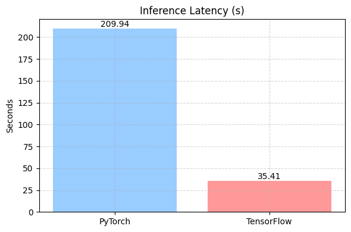
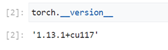

# ResNet50 PyTorch → TensorFlow 模型迁移与框架性能对比分析报告

## 1. 任务概述

本项目将预训练的 ResNet50 模型从 **PyTorch 框架迁移至 TensorFlow**，目标是在保持模型结构和训练配置一致的前提下，实现 **模型功能迁移**、**性能对比** 和 **部署适配**。

由于 PyTorch 更常用于研究实验，而 TensorFlow 在部署和工程化方面具备显著优势，因此本任务也评估两种框架在 Google Cloud 环境中的表现，并为后续模型开发提供推荐指引。

---

## 2. 迁移方案设计

### 2.1 Fine-tune 策略

#### 2.1.1 数据预处理

本任务采用公开图像分类数据集 [`oxford_flowers102`](https://www.tensorflow.org/datasets/catalog/oxford_flowers102)，包含 102 类花卉图像：

- 数据划分：前 80% 为训练集，后 20% 为验证集
- 预处理步骤包括：
  - **尺寸调整**：`resize()` 统一输入为 224×224
  - **归一化**：`preprocess_input()` 使用 ImageNet 均值方差
  - **数据增强**：`shuffle` + `repeat` + `batch` + `prefetch`
  - **标签处理**：使用 `cast()` 确保标签为整数类型

#### 2.1.2 模型结构设计

- 基础网络：`ResNet50(include_top=False, weights="imagenet")`
- 分类头结构：
  ```text
  GlobalAveragePooling2D
  Dense(128, activation='relu')
  Dropout(0.5)
  Dense(102, activation='softmax')
  ```

- 主干网络冻结，仅训练自定义分类头。

#### 2.1.3 超参数配置

| 超参数         | 值       |
|----------------|----------|
| Batch Size     | 32       |
| Learning Rate  | 1e-3     |
| Epochs         | 10       |
| Optimizer      | Adam     |
| Buffer Size (TF) | 1000   |

#### 2.1.4 评估指标说明

| 指标           | 描述说明                                                                 |
|----------------|--------------------------------------------------------------------------|
| 训练时长        | 使用 `time.time()` 记录训练总时长（均在 Vertex AI 上测试）                |
| 内存使用        | PyTorch 使用 `torch.cuda.max_memory_allocated()`；TF 使用 `psutil`        |
| 推理延迟        | 覆盖 `evaluate()` 推理阶段，记录总耗时                                  |
| 验证损失        | PyTorch 手动计算平均交叉熵；TF 自动通过 `model.evaluate()` 返回             |
| 验证准确率      | PyTorch 使用 `torch.max()`；TF 由 `model.evaluate()` 返回 `accuracy` 指标 |


### 2.2 框架迁移对比

#### 数据预处理接口对比

| 项目            | PyTorch                                             | TensorFlow                                               |
|-----------------|-----------------------------------------------------|----------------------------------------------------------|
| 数据集加载       | `torchvision.datasets.ImageFolder` + 自定义路径     | `tensorflow_datasets.load("oxford_flowers102")`         |
| 数据增强         | `transforms.Resize`, `transforms.ToTensor`         | `tf.image.resize`, `tf.cast`, `preprocess_input`        |
| Batch 管理       | `DataLoader(..., shuffle=True)`                    | `tf.data.Dataset.map().batch().prefetch()`              |

#### 模型实现接口对比

| 项目            | PyTorch                            | TensorFlow/Keras                               |
|-----------------|-------------------------------------|------------------------------------------------|
| 预训练模型加载   | `models.resnet50(pretrained=True)`  | `keras.applications.ResNet50(weights="imagenet")` |
| 分类层添加       | `nn.Sequential([...])`              | `keras.Sequential([...])`                      |
| 训练主循环       | `for epoch in range(...)`           | `model.fit()`                                  |

#### 模型评估接口对比

| 项目            | PyTorch                                    | TensorFlow                          |
|-----------------|---------------------------------------------|-------------------------------------|
| 推理切换         | `base_model.eval()` + 手动遍历验证集        | `model.evaluate()` 自动推理         |
| 精度/损失计算    | `CrossEntropyLoss()`, `torch.max()`         | `'sparse_categorical_crossentropy'`, `accuracy` |
| 模型保存格式     | `torch.save(model.state_dict())`            | `tf.saved_model.save(model, path)`  |

---

## 3. 差异分析


<div align="center">
  
  
</div>

<div align="center">
  
  
  
</div>

<p align="center">
  <b>Figure 1:</b> TensorFlow 和 PyTorch 框架在不同指标下的性能对比。红色表示当前指标下更优模型，蓝色表示相对较差模型。
</p>

| 指标             | 优胜者      | 说明 |
|------------------|-------------|------|
| 验证损失         | TensorFlow  | 模型收敛更好，泛化能力更强 |
| 验证准确率       | TensorFlow  | 精度大幅领先（0.64 vs 0.29） |
| 训练时长         | TensorFlow  | 加速约 40%，`tf.data` 管道高效 |
| 推理延迟         | TensorFlow  | 延迟降低 80%，适合部署场景 |
| 内存占用         | PyTorch     | 更轻量，占用更少资源 |

从结果看，TensorFlow 在 **准确性、速度、部署能力** 上全面领先，仅在内存效率上略逊一筹。这可能有由于TF 模型内部缓存更多张量、采用冗余 graph 机制，或 SavedModel 导致占用额外空间。

总体来看，TensorFlow更适合当前任务的框架实现。

---

## 4. 优劣势评估与应用建议

基于本次迁移与实测结果，两种框架在 **谷歌特定应用场景**下，TensorFlow的选择优先度高于PyTorch。

### TensorFlow 优势

- 支持云端部署，资源调度与分布式训练
- 训练与推理性能优越，适合工程部署
- 接口标准统一，适合团队协作与版本管理
- 丰富的部署方案支持（TFLite、TF.js、SavedModel、TF Serving）

### PyTorch 优势

- 调试灵活，内存占用更少
- 适合资源受限的本地运行环境
- 适合快速开发与研究实验
- 适合广泛开源模型的复现、测试

---

## 5. 分支任务报告

### 任务 1.1：Vertex AI 环境配置与使用体验

<div align="center">
  
  
  <b>Figure 2:</b> TensorFlow（左）和 PyTorch（右）环境配置成功截图
</div>

#### 使用体验笔记：

第一次使用 Vertex AI 是一个充满挑战但也非常值得的学习过程。 Vertex A I出色的环境配置与模型整合能力使其非常适合流水线式的深度学习任务开发。

Vertex AI 作为Google Cloud里的产品之一，在学习使用 Vertex AI 的过程中理解 Google Cloud 云平台的运作是第一步。这其中主要需要熟悉在 Vertex AI 中如何进行代码编辑、训练执行、数据存储、Pipeline 构建与模型上传等操作。尽管未能最终实现工程化部署，但认识到了真实工程中 MLOps 所需的各项核心功能。

这其中特别令人惊讶的是 VerTex AI 平台对 TensorFlow 环境依赖的自动配置支持。尤其是在尝试本地复现环境失败后更加钦佩 Vertex AI 的集成与部署便捷性。只是在 PyTorch 版本中遇到与 Numpy 的兼容性问题，已通过降级版本解决。

最后，我尝试基于官方指导文件构建一套端到端的 MLOps 流水线（使用 KFP 组件、Pipeline 构建、模型注册等）。但最终因权限受限无法查看日志，因此采用单机训练的方案在 TensorFlow 2.11.0 环境中完成。


---

### 任务 1.2：tf.data 数据管道优化策略

<div align="center">
  <br>
  <b>Figure 3:</b> 图像数据预处理流程
</div>

- 加载方式：`tfds.load("oxford_flowers102")`
- 主要操作：
  - `tf.image.resize()` → 图像尺寸标准化  
  - `tf.keras.applications.resnet50.preprocess_input()` → 数据归一化  
  - `map()` → 并行应用预处理函数  
  - `shuffle()` → 打乱样本顺序，提高多样性
  - `repeat()` → 重复整个数据集用于多轮训练
  - `batch()` → 分组便于模型并行处理
  - `prefetch()` → 提前加载数据

#### 优势总结：

相比于一般化的数据处理，使用tf.data构建图像数据管道具备缓存，预取，并行预处理等优化策略，可以提高训练效率和GPU的运行效率，优化内存占用，使得硬盘资源能被充分利用。此外，数据处理的流程也更加规范和系统化，可用于企业内部打包构建统一的标准化数据处理流程。

---

### 任务 1.3：模型保存格式与版本管理策略

#### 模型保存格式对比

| 属性 | SavedModel | HDF5 |
|------|------------|------|
| 文件结构 | 目录结构 | 单个 `.h5` 文件 |
| 保存内容 | 模型结构、权重、优化器状态、自定义层、计算图 | 模型结构、权重、优化器状态 |
| 适用场景 | 云部署（Vertex AI、TF Serving）、跨平台推理、模型导出 + 重载、Java/C++ 调用 | 本地开发、小型项目调试 |
| 限制 | 文件相对较大 | 不支持自定义子类化模型，不兼容 TF Serving 等部署平台 |

---

#### 模型版本控制与管理策略

- **参数管理**：使用 `.json` 配置文件统一管理 `batch_size`, `learning_rate`, `epochs` 等超参数。训练脚本支持将当前配置保存为 `config.json` 便于校对和实验复现。
- **目录结构化**：权重文件按实验命名存储，并在结果目录中添加README记录实验基本数据。
- **Git 版本控制策略**：
  1. 初始化并提交所有源码至 Git；
  2. 为每个独立实验任务创建专属分支（如：`exp1_resnet50_bs32_lr1e-3_e10`）；
  3. 使用 `git tag` 进行版本标记，确保快速回溯和部署；


